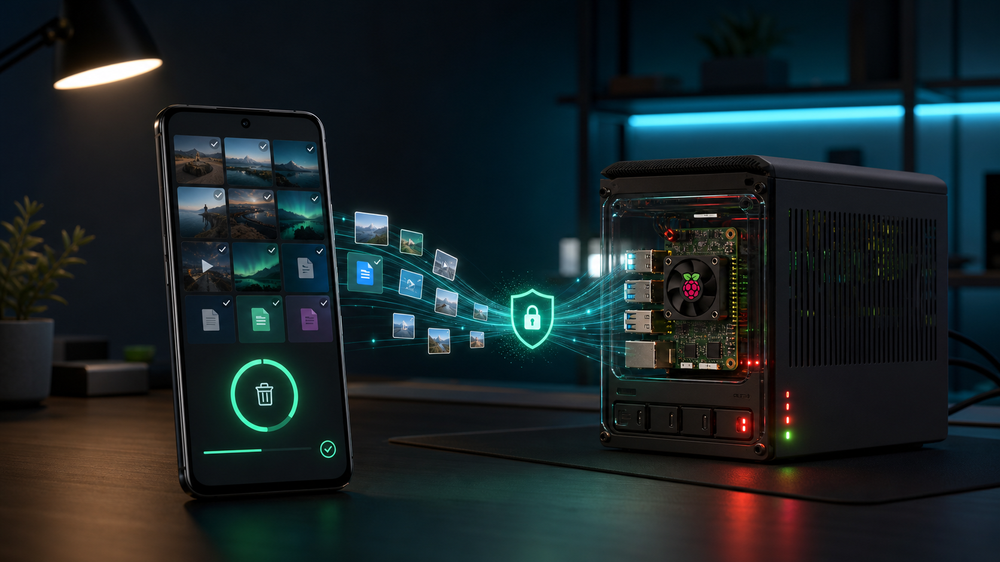
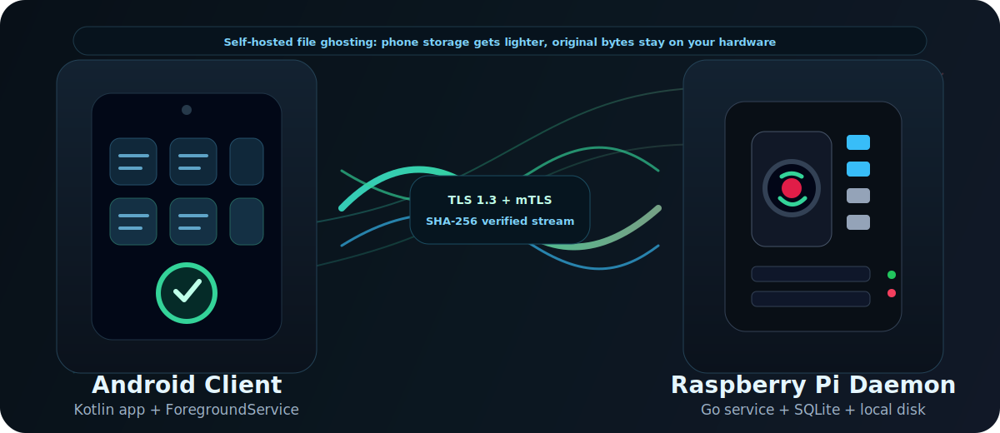
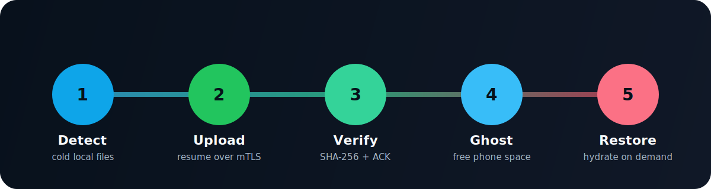

<h1 align="center">ShadowFS</h1>

<p align="center">
  <strong>Self-hosted file ghosting for Android + Raspberry Pi.</strong><br>
  Free phone storage without handing your files to a third-party cloud.
</p>

<p align="center">
  <a href="https://github.com/robycinix/ShadowFS/actions/workflows/ci.yml"></a>
  <a href="LICENSE"></a>
  
  
</p>

<p align="center">
  
</p>

ShadowFS moves inactive files from your Android phone to your own Raspberry Pi,
then restores them when you need them. Think storage optimization like iCloud,
but self-hosted, local-first, and protected by mutual TLS.

> Core safety rule: ShadowFS ghosts a local file only after the Raspberry Pi has
> received it, verified it with SHA-256, stored it, and sent a final ACK.

## At A Glance

| Own your storage | Free phone space | Verified transfers | Built for real devices |
| --- | --- | --- | --- |
| Files stay on your Raspberry Pi, not a subscription cloud. | Cold photos, videos, PDFs and archives become lightweight ghosts. | Uploads and restores are checksum-gated before local files are changed. | Foreground service, QR pairing, Tailscale-friendly networking and recovery paths. |

## What It Does

- Detects large inactive files on Android.
- Uploads originals to a Raspberry Pi daemon over TCP + TLS 1.3 + mTLS.
- Verifies file integrity with SHA-256.
- Replaces local files with tiny ghost markers or previews only after server ACK.
- Restores files on demand, using temporary downloads until verification passes.
- Keeps each paired device isolated under its own storage namespace.
- Defends against sync loops from Google Photos, OneDrive, Amazon Photos and
  similar backup apps.

## Architecture

<p align="center">
  
</p>

Default ports:

| Port | Purpose |
| --- | --- |
| `4243/tcp` | Android client protocol over TLS + mTLS |
| `4244/tcp` | temporary HTTP pairing endpoint for QR setup |
| `4242/udp` | experimental QUIC path, currently parked |

## Ghosting Flow

<p align="center">
  
</p>

Interrupted transfers are designed to be recoverable:

- uploads use `.part` files on the Raspberry Pi;
- downloads use `.shadowdl.tmp` files on Android;
- incomplete bytes are never published as final files.

## Project Status

ShadowFS is in field testing. The architecture is usable, but it is not yet a
polished consumer product and should not be treated as the only copy of
important data.

Recommended use today:

- test upload, restore and delete flows before trusting a folder;
- keep a separate backup for critical data;
- avoid mixing ShadowFS and aggressive cloud-sync tools on the same directory
  unless that directory is protected;
- validate real-device behavior with [TEST_CHECKLIST.md](TEST_CHECKLIST.md).

## Repository Layout

```text
.
├── shadow_client/          Android app, Kotlin + Gradle
├── shadow_daemon/          Raspberry Pi daemon, Go + SQLite
├── proto/                  future protocol schema
├── docs/assets/            README images and diagrams
├── USER_MANUAL.md          end-user setup and usage guide
├── DEPLOY_GUIDE.md         deployment guide for Android + Raspberry Pi
├── TEST_CHECKLIST.md       real-device validation checklist
└── ANDROID_APP_AUDIT.md    Android implementation audit notes
```

## Quick Start

### Raspberry Pi

```bash
git clone https://github.com/robycinix/ShadowFS.git
cd ShadowFS/shadow_daemon
sudo chmod +x install_raspberry.sh
sudo ./install_raspberry.sh
```

The installer builds the daemon, creates `/opt/shadowfs` and
`/storage/shadow_root`, generates mTLS certificates, installs a `systemd`
service and prints pairing information.

```bash
systemctl status shadowfs
journalctl -fu shadowfs
```

### Android

1. Open `shadow_client/` in Android Studio.
2. Let Gradle sync.
3. Connect a real Android device.
4. Run the debug build.
5. Pair the app with the Raspberry Pi by QR code or manual certificate import.

Manual build:

```powershell
cd shadow_client
.\gradlew.bat assembleDebug
```

## Tailscale

ShadowFS works best when Android can reach the Raspberry Pi through a private
network such as Tailscale.

```bash
curl -fsSL https://tailscale.com/install.sh | sh
sudo tailscale up
tailscale ip -4
```

Use the Raspberry Pi Tailscale IP in the Android app, or include it when
regenerating certificates:

```bash
sudo ./shadowdaemon --generate-certs \
  --server-ip="$(tailscale ip -4),$(hostname -I | awk '{print $1}')"
```

## Security Model

ShadowFS assumes the Raspberry Pi and Android device are controlled by the same
person or household.

- A private CA is generated locally.
- The daemon requires a valid client certificate.
- The Android app validates the daemon certificate.
- Each paired device gets an isolated storage namespace.
- Pairing tokens are short-lived and one-time use.
- Generated certificates, private keys, databases, logs and storage roots are
  ignored by git.

## Development

Run daemon checks:

```bash
cd shadow_daemon
go test ./...
go vet ./...
```

Build the Android client:

```powershell
cd shadow_client
.\gradlew.bat assembleDebug
```

GitHub Actions runs Go checks and an Android debug build on pushes and pull
requests to `main`.

## Documentation

- [User Manual](USER_MANUAL.md)
- [Deployment Guide](DEPLOY_GUIDE.md)
- [Real-Device Test Checklist](TEST_CHECKLIST.md)
- [Security Policy](SECURITY.md)
- [Contributing Guide](CONTRIBUTING.md)
- [Changelog](CHANGELOG.md)

## Roadmap

- [x] TCP + TLS + mTLS Android protocol
- [x] QR-code pairing
- [x] Resumable uploads
- [x] Resumable downloads
- [x] Per-device storage isolation
- [x] Manual restore list
- [x] Anti-loop handling for cloud backup apps
- [ ] Signed release builds
- [ ] Automated Android instrumentation tests
- [ ] Protocol versioning with Protobuf
- [ ] Optional QUIC transport after the TCP path is fully validated
- [ ] Incremental backup or block-level dedupe

## Contributing

Issues, bug reports and focused pull requests are welcome. Please read
[CONTRIBUTING.md](CONTRIBUTING.md) before opening a PR. This project handles
local files, so data-loss safety matters more than cosmetic speed.

## License

MIT. See [LICENSE](LICENSE).
